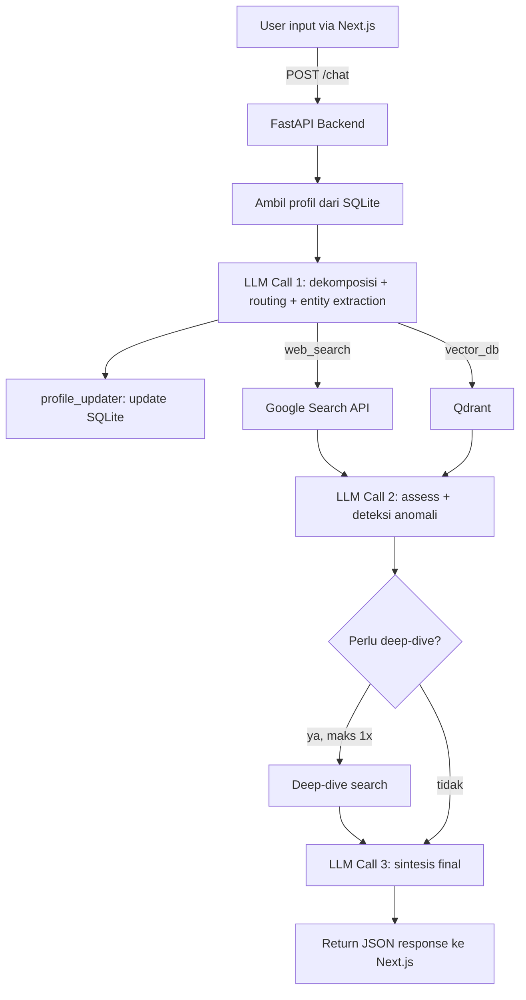

# Tech Spec: APPA

> **Dokumen ini adalah panduan teknis tim developer.** Berisi arsitektur, stack, project structure, database schema, dan standar kerja. Untuk positioning, persona, dan strategi bisnis, lihat [Blueprint](APPA_Blueprint.md).

---

## 1. Tech Stack

| Layer | Teknologi | Kenapa dipilih |
|---|---|---|
| **Frontend** | Next.js (React) | Full control UI/UX, SSR, App Router. Tim punya designer — Streamlit terlalu terbatas |
| **Backend** | FastAPI (Python) | Async-native, auto-generate OpenAPI docs, Python ecosystem untuk AI |
| **AI Model** | Qwen3-8B + QLoRA fine-tuning | 8B cukup untuk routing + gaya bahasa. QLoRA bisa training di Colab T4 |
| **AI Inference** | HuggingFace Inference API | Model di-host di HF Hub setelah fine-tune. Tidak perlu GPU di Docker — rulebook membolehkan model API |
| **Vector DB** | Qdrant | Docker image resmi, collection-based, gRPC, gratis |
| **Relational DB** | SQLite | Zero-config, file-based, cukup untuk single-user demo |
| **Search** | Google Search API / SerpAPI | Fan-out real-time untuk data pasar & kompetitor |
| **Containerization** | Docker Compose | Wajib rulebook — 3 services, 2 volumes |

**Kenapa bukan Streamlit?** Rulebook menilai **modularitas** dengan bobot 25% — "apakah komponen AI, backend, dan frontend terpisah dengan bersih?" Dengan Next.js + FastAPI, frontend dan backend adalah dua container terpisah yang berkomunikasi via REST API. Ini secara literal menjawab pertanyaan juri tentang pemisahan komponen.

---

## 2. Project Structure

Tiga folder utama (`frontend/`, `backend/`, `ai/`) masing-masing bisa diubah tanpa menyentuh yang lain. Juri yang buka repo langsung melihat pemisahan bersih.

```
appa/
├── docker-compose.yml          # Orchestrasi 3 container
├── README.md                   # Setup guide (baca Bagian 10)
├── .pre-commit-config.yaml     # Conventional commits enforcement
├── .commitlintrc.yml           # Commit message rules
│
├── frontend/                   # ─── FRONTEND (Next.js) ───
│   ├── Dockerfile
│   ├── package.json
│   ├── next.config.js
│   ├── src/
│   │   ├── app/
│   │   │   ├── layout.tsx      # Root layout, fonts, metadata
│   │   │   └── page.tsx        # Main chat page
│   │   ├── components/
│   │   │   ├── Chat.tsx        # Chat input/output
│   │   │   ├── MessageBubble.tsx
│   │   │   └── ProfileSidebar.tsx  # Read-only compliance status
│   │   ├── hooks/
│   │   │   └── useChat.ts      # Chat state management
│   │   ├── lib/
│   │   │   └── api.ts          # Fetch wrapper ke backend
│   │   └── styles/
│   │       └── globals.css
│   └── public/
│
├── backend/                    # ─── BACKEND (FastAPI + Python) ───
│   ├── Dockerfile
│   ├── requirements.txt
│   ├── main.py                 # FastAPI entry point
│   ├── api/
│   │   └── routes.py           # POST /chat, GET /profile
│   ├── core/
│   │   ├── agent.py            # Orchestrator: fan-out, routing, synthesis
│   │   ├── profile_manager.py  # SQLite read/write, implicit update
│   │   └── tool_executor.py    # Web search, Qdrant queries
│   ├── ai/
│   │   ├── inference.py        # HuggingFace API calls
│   │   ├── entity_extractor.py # Extract entities dari user input → JSON
│   │   └── prompts/
│   │       ├── decomposition.py    # LLM Call 1 templates
│   │       ├── assessment.py       # LLM Call 2 templates
│   │       └── synthesis.py        # LLM Call 3 templates
│   ├── db/
│   │   └── models.py           # SQLite schema & query helpers
│   └── config.py               # Environment vars, constants
│
├── training/                   # ─── AI TRAINING (Colab, bukan Docker) ───
│   ├── fine_tune/
│   │   ├── train.py            # QLoRA training script
│   │   └── config.yaml         # Hyperparameters
│   ├── evaluate/
│   │   └── run_eval.py         # Test set 30-50 Q&A
│   └── datasets/
│       └── training_data.jsonl # 1000 entri, 4 klaster
│
├── data/
│   ├── regulatory_rules.json   # Single source of truth (lihat Blueprint §5)
│   └── seed/
│       └── seed_qdrant.py      # Ingest awal ke Qdrant
│
└── scripts/
    └── setup.sh                # One-click local dev setup
```

**Catatan penting:**
- `training/` **tidak masuk Docker** — fine-tuning dilakukan di Colab/HuggingFace, hasilnya di-push ke HF Hub. Panitia tidak perlu GPU.
- `backend/ai/` berisi kode **inference** (panggil HF API) — bukan training.
- `data/regulatory_rules.json` adalah **satu sumber kebenaran** untuk regulasi — dipakai oleh Qdrant seeding dan dataset generator.

---

## 3. Arsitektur Sistem

**Bounded fan-out, maksimal 3x panggilan LLM** (best-case 2x). Sinkron — tidak ada background job (aturan rulebook).



### Data flow per LLM call

| Call | Input | Output | Catatan |
|---|---|---|---|
| **LLM Call 1** | User message + user profile | `{route, sub_queries[], extracted_entities}` | Entity extraction terjadi di sini — bukan call terpisah |
| **LLM Call 2** | Search results + Qdrant results + profile | `{assessment, anomaly_flag, need_deep_dive}` | Jika `need_deep_dive=false`, langsung ke sintesis |
| **LLM Call 3** | Semua konteks + deep-dive results (opsional) | Final response (laporan konsolidasi) | Output terformat sesuai Klaster B dataset |

### API Endpoints

| Method | Path | Fungsi | Request | Response |
|---|---|---|---|---|
| `POST` | `/chat` | Kirim pesan, terima respons AI | `{user_id, message}` | `{response, profile_summary, sources[]}` |
| `GET` | `/profile/{user_id}` | Ambil profil untuk sidebar | — | `{business_type, product, location, compliance_status[]}` |
| `POST` | `/seed` | Trigger Qdrant seeding (dev only) | — | `{status, collections_created}` |

---

## 4. Docker Compose

Tiga container, dua volume. Panitia cukup jalankan `docker compose up --build`.

```yaml
version: "3.8"

services:
  qdrant:
    image: qdrant/qdrant:latest
    ports:
      - "6333:6333"
      - "6334:6334"
    volumes:
      - qdrant_data:/qdrant/storage
    healthcheck:
      test: ["CMD", "curl", "-f", "http://localhost:6333/healthz"]
      interval: 10s
      timeout: 5s
      retries: 3

  backend:
    build:
      context: ./backend
      dockerfile: Dockerfile
    ports:
      - "8000:8000"
    volumes:
      - db_data:/app/data
    environment:
      - QDRANT_HOST=qdrant
      - QDRANT_PORT=6333
      - HF_MODEL_ID=appa/qwen3-8b-finetuned  # ganti setelah training
      - HF_API_TOKEN=${HF_API_TOKEN}
      - SEARCH_API_KEY=${SEARCH_API_KEY}
    depends_on:
      qdrant:
        condition: service_healthy

  frontend:
    build:
      context: ./frontend
      dockerfile: Dockerfile
    ports:
      - "3000:3000"
    environment:
      - NEXT_PUBLIC_API_URL=http://backend:8000
    depends_on:
      - backend

volumes:
  db_data:       # SQLite — profil pengguna, compliance_status
  qdrant_data:   # Indeks vektor & embedding regulasi
```

**Yang perlu diperhatikan tim:**
- `QDRANT_HOST=qdrant` dan `NEXT_PUBLIC_API_URL=http://backend:8000` — di dalam Docker network, container akses via **nama service**, bukan `localhost`.
- `HF_API_TOKEN` dan `SEARCH_API_KEY` disimpan di file `.env` (jangan commit ke Git). Tambahkan `.env.example` sebagai referensi.
- **Test wajib sebelum submit:** clone repo ke folder baru → buat `.env` → `docker compose up --build` → pastikan berjalan tanpa error. Ini yang akan dilakukan panitia.

### Dockerfile contoh (backend)

```dockerfile
FROM python:3.11-slim

WORKDIR /app
COPY requirements.txt .
RUN pip install --no-cache-dir -r requirements.txt

COPY . .
EXPOSE 8000
CMD ["uvicorn", "main:app", "--host", "0.0.0.0", "--port", "8000"]
```

### Dockerfile contoh (frontend)

```dockerfile
FROM node:20-alpine AS builder
WORKDIR /app
COPY package*.json ./
RUN npm ci
COPY . .
RUN npm run build

FROM node:20-alpine AS runner
WORKDIR /app
COPY --from=builder /app/.next ./.next
COPY --from=builder /app/node_modules ./node_modules
COPY --from=builder /app/package.json ./
EXPOSE 3000
CMD ["npm", "start"]
```

---

## 5. Komponen AI

### Fine-tuning (di Colab / HuggingFace, bukan Docker)

- **Model dasar:** Qwen3-8B (utama) / Llama-3.1-8B-Instruct (alternatif)
- **Metode:** QLoRA (rank 16, alpha 32, 4-bit NF4)
- **Environment:** Google Colab T4 (gratis) atau HuggingFace AutoTrain
- **Output:** Model adapter di-push ke HuggingFace Hub → diakses via Inference API

**Fokus fine-tuning:**
- Klaster A (gaya bahasa dagang informal) — model menjawab santai, bukan kaku ala pasal UU
- Klaster B (konsistensi format output 5 bagian) — termasuk bagian ke-5 "Status Kepatuhan" yang kondisional

**Bukan** untuk routing/JSON generation — itu tetap structured function-calling deterministik.

### Inference (di Docker, via HuggingFace API)

```python
# backend/ai/inference.py (simplified)
from huggingface_hub import InferenceClient

client = InferenceClient(model=config.HF_MODEL_ID, token=config.HF_API_TOKEN)

def call_llm(prompt: str, system_prompt: str) -> str:
    response = client.text_generation(
        prompt=f"<|system|>{system_prompt}<|user|>{prompt}<|assistant|>",
        max_new_tokens=2048,
        temperature=0.3,
    )
    return response
```

### Dataset (1.000 entri, 4 klaster)

Semua klaster regulasi di-generate dari `data/regulatory_rules.json` (Blueprint §5), bukan ditulis manual terpisah.

| Klaster | Jumlah | Isi |
|---|---|---|
| **A** — Bahasa dagang | 250 | ~25-30% skenario compliance dicampur natural ("jual keripik dari dapur, laku di grup WA, mau naik reseller — perlu diurus apa?") |
| **B** — Format output | 250 | 4 bagian riset pasar + bagian ke-5 "Status Kepatuhan" (kondisional). Sertakan contoh negatif (bagian ke-5 kosong) |
| **C** — Tool-use triggers | 250 | Variasi query SPP-IRT/BPOM/Halal, bukan cuma NIB |
| **D** — Kesinambungan sesi | 250 | Kontinuitas checklist regulasi ("Dua minggu lalu NIB sudah terbit; lanjut SPP-IRT") |

### Evaluasi (versi ringan, cukup untuk klaim ke juri)

- Test set **30–50 pasang Q&A regulasi** berlabel, termasuk kasus ambigu
- Cek akurasi/faithfulness (benar/salah + alasan), dipisah regulasi vs. non-regulasi
- Loss curve + perbandingan before/after fine-tuning

Jika waktu makin sempit, **fine-tuning adalah lapisan paling mudah dipangkas** — prompting yang baik bisa menutupi gaya bahasa; jawaban regulasi yang salah tidak bisa ditutupi apa pun.

---

## 6. Komponen Backend (FastAPI)

### Agent Orchestrator (`core/agent.py`)

```python
# Simplified flow
async def handle_chat(user_id: str, message: str) -> ChatResponse:
    # 1. Ambil profil
    profile = profile_manager.get_profile(user_id)
    
    # 2. LLM Call 1: dekomposisi + entity extraction
    call1_result = await inference.call_llm(
        prompt=message,
        system_prompt=prompts.decomposition(profile)
    )
    route = call1_result.route
    entities = call1_result.extracted_entities
    
    # 3. Update profil (implicit, sebelum call 2)
    profile_manager.update_profile(user_id, entities)
    
    # 4. Fan-out: search + vector DB (paralel)
    search_task = tool_executor.web_search(call1_result.sub_queries)
    qdrant_task = tool_executor.vector_search(call1_result.sub_queries)
    search_results, qdrant_results = await asyncio.gather(search_task, qdrant_task)
    
    # 5. LLM Call 2: assessment
    call2_result = await inference.call_llm(
        prompt=build_context(search_results, qdrant_results, profile),
        system_prompt=prompts.assessment()
    )
    
    # 6. Conditional deep-dive (LLM Call 3)
    if call2_result.need_deep_dive:
        deep_results = await tool_executor.deep_search(call2_result.deep_query)
        final = await inference.call_llm(...)
    else:
        final = call2_result.synthesis
    
    return ChatResponse(response=final, profile_summary=profile)
```

### Mekanisme Anti-Halusinasi (The "JSON Railway" Pattern)

Untuk mencegah LLM berhalusinasi mengarang urutan izin (yang berakibat fatal pada nilai *compliance*), kita mengimplementasikan pola injeksi instruksi ketat (Agentic Workflow):
1. **LLM Mengekstrak, bukan Menjawab:** Pada LLM Call 1, model hanya bertugas mendeteksi entitas (misal: `{"kategori": "fb_mikro"}`). LLM **tidak** diizinkan menjawab urutan hukum di tahap ini.
2. **Python Mengambil Alih (Rule-Based):** Script Python backend mencocokkan `"fb_mikro"` dengan `regulatory_rules.json` dan mendapatkan kepastian urutan absolut: `[NIB, SPP-IRT, Halal]`. Python lalu menarik detail teks tiap izin dari Qdrant (RAG).
3. **Injeksi Prompt Ketat (Call 2):** Python merakit *System Prompt* yang mendikte LLM secara mutlak: *"Aturan sistem: Klien WAJIB mengurus 1. NIB, 2. SPP-IRT, 3. Halal (Tenggat 17 Okt 2026). Konteks Qdrant: [...]. Tugasmu: Sintesiskan menjadi laporan format Wayfinder."*
4. **Hasil Deterministik:** LLM dipaksa menjadi sekadar "penulis laporan" yang merapikan logika Python. Ini memastikan akurasi urutan hukum 100% tanpa mengorbankan keluwesan bahasa AI.

### Profile Manager (`core/profile_manager.py`)

**Implicit update tanpa UI tambahan** — sesuai batasan MVP rulebook (UI hanya input tunggal + output AI).

Alur per request:
1. User mengirim pesan via chat (satu-satunya input)
2. LLM Call 1 menghasilkan `extracted_entities` (JSON) sebagai bagian dari routing
3. `profile_updater()` membandingkan entities vs profil SQLite → UPDATE field yang berubah
4. Profil terbaru dipakai sebagai konteks LLM Call 2 & 3
5. Respons dikembalikan — user hanya melihat chat biasa

**Yang TIDAK boleh dibangun (overbuilt per rulebook):**
- ❌ Tombol "Simpan Profil" / halaman edit profil
- ❌ Dashboard riwayat perubahan profil

**Yang boleh & direkomendasikan:**
- ✅ Sidebar read-only compliance status (NIB: ✅, SPP-IRT: ❌, Halal: ❌)
- ✅ Konfirmasi implisit dalam respons ("Saya catat bahwa bisnis Anda...")

---

## 7. Komponen Frontend (Next.js)

### Layout

UI fokus pada satu hal: **chat input tunggal, output AI.** Tidak ada halaman lain.

```
┌─────────────────────────────────────────────┐
│  APPA              [Profile Badge]  │
├──────────┬──────────────────────────────────┤
│          │                                   │
│ Sidebar  │         Chat Area                 │
│ (read-   │                                   │
│  only)   │  ┌─────────────────────────────┐  │
│          │  │ AI: Untuk usaha keripik...   │  │
│ NIB: ✅  │  │                              │  │
│ SPP: ❌  │  │ User: Saya jual keripik...   │  │
│ Halal: ❌│  │                              │  │
│          │  └─────────────────────────────┘  │
│          │                                   │
│          │  ┌─────────────────────────────┐  │
│          │  │ Ketik pesan...         [➤]  │  │
│          │  └─────────────────────────────┘  │
└──────────┴──────────────────────────────────┘
```

### Komunikasi dengan backend

```typescript
// frontend/src/lib/api.ts
const API_URL = process.env.NEXT_PUBLIC_API_URL || 'http://localhost:8000';

export async function sendMessage(userId: string, message: string) {
  const res = await fetch(`${API_URL}/chat`, {
    method: 'POST',
    headers: { 'Content-Type': 'application/json' },
    body: JSON.stringify({ user_id: userId, message }),
  });
  return res.json(); // { response, profile_summary, sources[] }
}

export async function getProfile(userId: string) {
  const res = await fetch(`${API_URL}/profile/${userId}`);
  return res.json();
}
```

---

## 8. Database Schemas

### SQLite — User Profile

```sql
CREATE TABLE user_profiles (
    user_id         TEXT PRIMARY KEY,
    business_type   TEXT,
    product_category TEXT,
    target_location TEXT,
    key_facts       TEXT,  -- JSON
    compliance_status TEXT, -- JSON: [{"item": "NIB", "status": "done", "timestamp": "..."}, ...]
    last_updated    TEXT   -- ISO 8601
);
```

### Qdrant — Collections

| Koleksi | Isi | Sumber | Update |
|---|---|---|---|
| **Regulasi & Perizinan** | NIB, SPP-IRT/BPOM, Halal, PPh Final | `regulatory_rules.json` → chunked + embedded | Ad hoc + verifikasi tiap milestone |
| **Demografi & Sosioekonomi** | Populasi, pendapatan, kepadatan per kecamatan | BPS, Satu Data Indonesia | Tahunan |
| **Harga Acuan Komoditas** | Baseline harga pangan strategis | PIHPS BI, Kemendag | Bulanan |
| **Skema Pembiayaan UMKM** | KUR (plafon Rp308,41T 2026, bunga 6%/3%) | kur.kemenkeu.go.id | Tahunan |
| **Studi Kasus UMKM** | Pola sukses/gagal | Jurnal Kemenkop UKM | Ad hoc |

Untuk babak penyisihan, prioritaskan **Regulasi** dan **Demografi**, cakupan 2–3 kota contoh. Mitigasi latensi: fan-out paralel, caching TTL 10–15 menit untuk data volatil, mock search toggle untuk demo offline.

---

## 9. Git Workflow & Conventional Commits

**Kenapa ini wajib:** Rulebook mewajibkan setiap commit mengikuti format Conventional Commits. Satu commit acak ("update dikit") = catatan buruk saat juri periksa Git history.

### Setup (sekali per anggota tim)

**1. Install:**
```bash
pip install pre-commit
npm install --save-dev @commitlint/{cli,config-conventional}
```

**2. `.commitlintrc.yml` (sudah ada di repo):**
```yaml
extends:
  - "@commitlint/config-conventional"
rules:
  type-enum:
    - 2
    - always
    - [feat, fix, refactor, docs, style, test, chore, ci, build]
```

**3. `.pre-commit-config.yaml` (sudah ada di repo):**
```yaml
repos:
  - repo: https://github.com/alessandrojcm/commitlint-pre-commit-hook
    rev: v9.18.0
    hooks:
      - id: commitlint
        stages: [commit-msg]
        additional_dependencies: ["@commitlint/config-conventional"]
```

**4. Aktifkan hook:**
```bash
pre-commit install --hook-type commit-msg
```

| Pesan commit | Status |
|---|---|
| `feat: tambah modul checklist regulasi halal` | ✅ |
| `fix: perbaiki koneksi qdrant timeout` | ✅ |
| `refactor: pisahkan profile_updater ke modul sendiri` | ✅ |
| `update dikit` | ❌ Ditolak otomatis |

---

## 10. Development Setup Guide (untuk README.md)

### Prerequisites
- Docker & Docker Compose
- Node.js 20+ (untuk frontend dev)
- Python 3.11+ (untuk backend dev)

### Quick Start (production-like, via Docker)
```bash
git clone https://github.com/[tim]/appa.git
cd appa
cp .env.example .env        # isi HF_API_TOKEN dan SEARCH_API_KEY
docker compose up --build   # tunggu sampai semua service healthy
# Buka http://localhost:3000
```

### Local Development (tanpa Docker)
```bash
# Terminal 1: Qdrant
docker run -p 6333:6333 -p 6334:6334 qdrant/qdrant:latest

# Terminal 2: Backend
cd backend
python -m venv venv && source venv/bin/activate
pip install -r requirements.txt
uvicorn main:app --reload --port 8000

# Terminal 3: Frontend
cd frontend
npm install
npm run dev
# Buka http://localhost:3000
```

### Seed data
```bash
cd data/seed
python seed_qdrant.py  # Ingest regulatory_rules.json ke Qdrant
```

---

## 11. Pembagian Peran Tim & Timeline Teknis

### Pembagian Peran Teknis

| Member | Fokus Utama | Tanggung Jawab Konkret |
|---|---|---|
| **Gilang** | Frontend, Backend (API), Prompts | Next.js UI/UX, layout output (Wayfinder-style), FastAPI routes, prompt engineering |
| **Arya** | AI, Data, Infrastruktur | Kurasi `regulatory_rules.json`, dataset 1000 entri, QLoRA fine-tuning, deploy HF, Qdrant seeding, Docker setup, evaluasi model |
| **Adillah** | Bisnis, Deliverables, Validasi | Pembuatan proposal 20 halaman, produksi 2 video (Proof of Work & Promo), wawancara validasi bisnis, dokumentasi README |

### Fase Eksekusi Paralel (Deadline 25 Agustus 2026)

**Fase 1: Foundation & Data (Minggu 1–2 | 18–31 Juli)**
- **Gilang:** Setup Docker (Next.js + FastAPI), rute API `/chat` dengan *prompt* dasar, dan *setup* Git Hooks.
- **Arya:** Kurasi `regulatory_rules.json`, susun dataset 1.000 entri, dan *script ingest* ke Qdrant.
- **Adillah:** Riset kompetitor, draf kerangka proposal 20 halaman, dan wawancara validasi UMKM awal.

**Fase 2: Core Development & Fine-Tuning (Minggu 3–4 | 1–14 Agustus)**
- **Gilang:** Selesaikan UI/UX Next.js (khususnya *layout* konsolidasi ala Wayfinder), integrasi penuh ke *backend API*.
- **Arya:** *Training* QLoRA di Colab, evaluasi model, *deploy* ke HF Hub, dan *update endpoint* backend.
- **Adillah:** Finalisasi isi proposal (menyesuaikan hasil fitur dari Gilang & Arya), mulai menyusun naskah/storyboard video.

**Fase 3: Integration & Deliverables (Minggu 5–6 | 15–25 Agustus)**
- **Gilang & Arya:** *Testing End-to-End*, *freeze* kode, perbaikan *bug*. Simulasi run `docker compose up --build` dari nol.
- **Adillah:** Rekam dan edit 2 video (Proof of Work & Promo), finalisasi README, dan *submit* seluruh berkas sebelum 25 Agustus 23:55 WIB.
