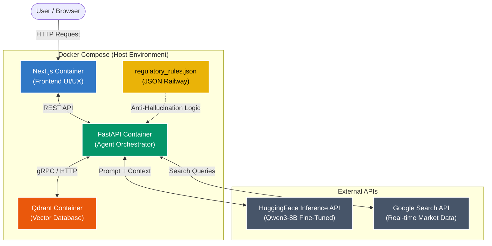
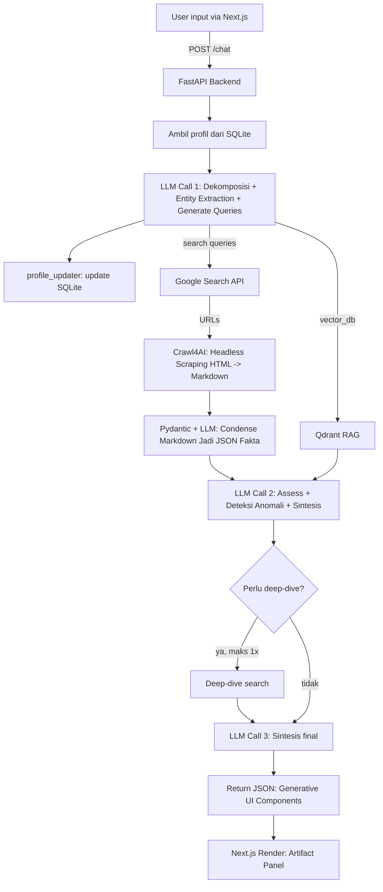

# Tech Spec: APPA (Analisa Pasar Pintar & Akurat)

> **Dokumen ini adalah panduan teknis tim developer.** Berisi arsitektur, stack, project structure, database schema, dan standar kerja untuk APPA (Analisa Pasar Pintar & Akurat). Untuk positioning, persona, dan strategi bisnis, lihat [Blueprint](APPA_Blueprint.md).

---

## Arsitektur Sistem (High-Level)

Diagram ini mengilustrasikan **Modular Architecture** (bobot penilaian Juri 25%) yang memisahkan Frontend, Backend, dan Database ke dalam container terpisah, dengan eksekusi LLM dilakukan via API eksternal (HuggingFace) agar hemat *resource* sesuai *rulebook*.



---

## 1. Tech Stack

| Layer | Teknologi | Kenapa dipilih |
|---|---|---|
| **Frontend** | Next.js (React) | Full control UI/UX, SSR, App Router. Tim punya designer — Streamlit terlalu terbatas |
| **Backend** | FastAPI (Python) | Async-native, auto-generate OpenAPI docs, Python ecosystem untuk AI |
| **AI Model** | Qwen3-8B + QLoRA fine-tuning | 8B cukup untuk routing + gaya bahasa. QLoRA bisa training di Colab T4 |
| **AI Inference** | HuggingFace Inference API | Model di-host di HF Hub setelah fine-tune. Tidak perlu GPU di Docker — rulebook membolehkan model API |
| **Vector DB** | Qdrant | Docker image resmi, collection-based, gRPC, gratis |
| **Relational DB** | SQLite | Zero-config, file-based, cukup untuk single-user demo |
| **Search** | Google Search API / SerpAPI | Fan-out real-time untuk data pasar & kompetitor |
| **Containerization** | Docker Compose | Wajib rulebook — 3 services, 2 volumes |

**Kenapa bukan Streamlit?** Rulebook menilai **modularitas** dengan bobot 25% — "apakah komponen AI, backend, dan frontend terpisah dengan bersih?" Dengan Next.js + FastAPI, frontend dan backend adalah dua container terpisah yang berkomunikasi via REST API. Ini secara literal menjawab pertanyaan juri tentang pemisahan komponen.

---

## 2. Project Structure

Tiga folder utama (`frontend/`, `backend/`, `ai/`) masing-masing bisa diubah tanpa menyentuh yang lain. Juri yang buka repo langsung melihat pemisahan bersih.

```
appa/
├── docker-compose.yml          # Orchestrasi 3 container
├── README.md                   # Setup guide (baca Bagian 10)
├── .pre-commit-config.yaml     # Conventional commits enforcement
├── .commitlintrc.yml           # Commit message rules
│
├── frontend/                   # ─── FRONTEND (Next.js) ───
│   ├── Dockerfile
│   ├── package.json
│   ├── next.config.js
│   ├── src/
│   │   ├── app/
│   │   │   ├── layout.tsx      # Root layout, fonts, metadata
│   │   │   └── page.tsx        # Main chat page
│   │   ├── components/
│   │   │   ├── Chat.tsx        # Chat input/output
│   │   │   ├── MessageBubble.tsx
│   │   │   └── ProfileSidebar.tsx  # Read-only compliance status
│   │   ├── hooks/
│   │   │   └── useChat.ts      # Chat state management
│   │   ├── lib/
│   │   │   └── api.ts          # Fetch wrapper ke backend
│   │   └── styles/
│   │       └── globals.css
│   └── public/
│
├── backend/                    # ─── BACKEND (FastAPI + Python) ───
│   ├── Dockerfile
│   ├── requirements.txt
│   ├── main.py                 # FastAPI entry point
│   ├── api/
│   │   └── routes.py           # POST /chat, GET /profile
│   ├── core/
│   │   ├── agent.py            # Orchestrator: fan-out, routing, synthesis
│   │   ├── profile_manager.py  # SQLite read/write, implicit update
│   │   └── tool_executor.py    # Web search, Qdrant queries
│   ├── ai/
│   │   ├── inference.py        # HuggingFace API calls
│   │   ├── entity_extractor.py # Extract entities dari user input → JSON
│   │   └── prompts/
│   │       ├── decomposition.py    # LLM Call 1 templates
│   │       ├── assessment.py       # LLM Call 2 templates
│   │       └── synthesis.py        # LLM Call 3 templates
│   ├── db/
│   │   └── models.py           # SQLite schema & query helpers
│   └── config.py               # Environment vars, constants
│
├── training/                   # ─── AI TRAINING (Colab, bukan Docker) ───
│   ├── fine_tune/
│   │   ├── train.py            # QLoRA training script
│   │   └── config.yaml         # Hyperparameters
│   ├── evaluate/
│   │   └── run_eval.py         # Test set 30-50 Q&A
│   └── datasets/
│       └── training_data.jsonl # 1000 entri, 4 klaster
│
├── data/
│   ├── regulatory_rules.json   # Single source of truth (lihat Blueprint §5)
│   └── seed/
│       └── seed_qdrant.py      # Ingest awal ke Qdrant
│
└── scripts/
    └── setup.sh                # One-click local dev setup
```

**Catatan penting:**
- `training/` **tidak masuk Docker** — fine-tuning dilakukan di Colab/HuggingFace, hasilnya di-push ke HF Hub. Panitia tidak perlu GPU.
- `backend/ai/` berisi kode **inference** (panggil HF API) — bukan training.
- `data/regulatory_rules.json` adalah **satu sumber kebenaran** untuk regulasi — dipakai oleh Qdrant seeding dan dataset generator.

---

## 3. Arsitektur Sistem

**Bounded fan-out, maksimal 3x panggilan LLM** (best-case 2x). Sinkron — tidak ada background job (aturan rulebook).



### Data flow per LLM call

| Call | Input | Output | Catatan |
|---|---|---|---|
| **LLM Call 1 (Riset)** | User message + user profile | `{route, sub_queries[], extracted_entities}` | Entity extraction & Query Generation terjadi di sini |
| **LLM Call 2 (Analisis)** | Condensed Search + Qdrant results + profile | `{assessment, anomaly_flag, need_deep_dive}` | Jika `need_deep_dive=false`, langsung ke sintesis UI |
| **LLM Call 3** | Semua konteks + deep-dive results (opsional) | Final response (laporan konsolidasi) | Output terformat sesuai Klaster B dataset |

### API Endpoints (Kontrak Data Frontend & Backend)

Demi menjaga konsistensi antara Frontend (Next.js) dan Backend (FastAPI), berikut adalah kontrak data mutlak (*Payload* JSON) untuk 3 *endpoint* utama:

#### 1. `POST /chat` (Core Engine)
Digunakan oleh Frontend untuk mengirim pesan dan menerima balasan berupa *array* komponen *Generative UI*.
- **Request Body:**
  ```json
  {
    "user_id": "user_123",
    "message": "Modal saya 5 juta, harga pasaran berapa?",
    "chat_history": [
       {"role": "user", "content": "Halo"},
       {"role": "assistant", "content": "Ada yang bisa dibantu?"}
    ]
  }
  ```
  *(Catatan Penting - Token Limit: Frontend WAJIB menerapkan pola **Sliding Window**. Jangan kirim seluruh riwayat dari awal. Cukup potong dan kirim **10 pesan terakhir** ke dalam array `chat_history` agar API HuggingFace tidak error kehabisan memory/context window).*
- **Response Body:**
  ```json
  {
    "components": [
      {
        "ui_type": "text",
        "content": "Berdasarkan modal 5 juta, ini rekomendasinya. [Buka Dashboard]",
        "sources": []
      },
      {
        "ui_type": "pricing",
        "hpp": 5000,
        "market_avg": 12000,
        "recommendation": 10000,
        "sources": ["SerpApi Google Shopping"]
      }
    ],
    "profile_updated": true 
  }
  ```

#### 2. `GET /profile/{user_id}` (Profile Persistence)
Digunakan oleh *Sidebar* Frontend untuk merender data bisnis *user* secara pasif (Read-Only).
- **Response Body:**
  ```json
  {
    "business_type": "F&B Mikro",
    "product_category": "Keripik Singkong",
    "capital_hpp": 5000,
    "compliance_status": [
      {"item": "NIB", "status": "done"},
      {"item": "SPP-IRT", "status": "pending"}
    ]
  }
  ```

#### 3. `POST /seed` (Dev / Setup Only)
Trigger awal untuk memasukkan `regulatory_rules.json` ke dalam Qdrant Vector DB saat *deployment*.
- **Response:** `{"status": "success", "collections_created": ["regulations"]}`

---

## 4. Docker Compose

Tiga container, dua volume. Panitia cukup jalankan `docker compose up --build`.

```yaml
version: "3.8"

services:
  qdrant:
    image: qdrant/qdrant:latest
    ports:
      - "6333:6333"
      - "6334:6334"
    volumes:
      - qdrant_data:/qdrant/storage
    healthcheck:
      test: ["CMD", "curl", "-f", "http://localhost:6333/healthz"]
      interval: 10s
      timeout: 5s
      retries: 3

  backend:
    build:
      context: ./backend
      dockerfile: Dockerfile
    ports:
      - "8000:8000"
    volumes:
      - db_data:/app/data
    environment:
      - QDRANT_HOST=qdrant
      - QDRANT_PORT=6333
      - HF_MODEL_ID=appa/qwen3-8b-finetuned  # ganti setelah training
      - HF_API_TOKEN=${HF_API_TOKEN}
      - SEARCH_API_KEY=${SEARCH_API_KEY}
    depends_on:
      qdrant:
        condition: service_healthy

  frontend:
    build:
      context: ./frontend
      dockerfile: Dockerfile
    ports:
      - "3000:3000"
    environment:
      - NEXT_PUBLIC_API_URL=http://backend:8000
    depends_on:
      - backend

volumes:
  db_data:       # SQLite — profil pengguna, compliance_status
  qdrant_data:   # Indeks vektor & embedding regulasi
```

**Yang perlu diperhatikan tim:**
- `QDRANT_HOST=qdrant` dan `NEXT_PUBLIC_API_URL=http://backend:8000` — di dalam Docker network, container akses via **nama service**, bukan `localhost`.
- `HF_API_TOKEN` dan `SEARCH_API_KEY` disimpan di file `.env` (jangan commit ke Git). Tambahkan `.env.example` sebagai referensi.
- **Test wajib sebelum submit:** clone repo ke folder baru → buat `.env` → `docker compose up --build` → pastikan berjalan tanpa error. Ini yang akan dilakukan panitia.

### Dockerfile contoh (backend)

```dockerfile
FROM python:3.11-slim

WORKDIR /app
COPY requirements.txt .
RUN pip install --no-cache-dir -r requirements.txt

COPY . .
EXPOSE 8000
CMD ["uvicorn", "main:app", "--host", "0.0.0.0", "--port", "8000"]
```

### Dockerfile contoh (frontend)

```dockerfile
FROM node:20-alpine AS builder
WORKDIR /app
COPY package*.json ./
RUN npm ci
COPY . .
RUN npm run build

FROM node:20-alpine AS runner
WORKDIR /app
COPY --from=builder /app/.next ./.next
COPY --from=builder /app/node_modules ./node_modules
COPY --from=builder /app/package.json ./
EXPOSE 3000
CMD ["npm", "start"]
```

---

## 5. Komponen AI

### Fine-tuning (di Google Colab dengan Unsloth)

- **Model dasar:** `Qwen3-4B-Instruct` (Utama) / `Qwen3-8B-Instruct` (Alternatif Cloud)
- **Framework:** **Unsloth** (Wajib, karena 2x lebih cepat dan sangat hemat VRAM, sangat optimal untuk Google Colab T4 gratis).
- **Metode:** QLoRA (rank 16, alpha 32, 4-bit NF4)
- **Output:** Model adapter (GGUF/Safetensors) di-push ke HuggingFace Hub → diakses via Inference API (Bukan deploy lokal pakai Ollama/vLLM saat demo agar Docker tetap ringan).

**Fokus fine-tuning:**
- Klaster A (gaya bahasa dagang informal) — model menjawab santai, bukan kaku ala pasal UU
- Klaster B (konsistensi format output 5 bagian) — termasuk bagian ke-5 "Status Kepatuhan" yang kondisional

**Bukan** untuk routing/JSON generation — itu tetap structured function-calling deterministik.

### Inference (di Docker, via HuggingFace API)

```python
# backend/ai/inference.py (simplified)
from huggingface_hub import InferenceClient

client = InferenceClient(model=config.HF_MODEL_ID, token=config.HF_API_TOKEN)

def call_llm(prompt: str, system_prompt: str) -> str:
    response = client.text_generation(
        prompt=f"<|system|>{system_prompt}<|user|>{prompt}<|assistant|>",
        max_new_tokens=2048,
        temperature=0.3,
    )
    return response
```

### Dataset (1.000 entri, 4 klaster)

Semua klaster regulasi di-generate dari `data/regulatory_rules.json` (Blueprint §5), bukan ditulis manual terpisah.

| Klaster | Jumlah | Isi |
|---|---|---|
| **A** — Bahasa dagang | 250 | ~25-30% skenario compliance dicampur natural ("jual keripik dari dapur, laku di grup WA, mau naik reseller — perlu diurus apa?") |
| **B** — Format output | 250 | 4 bagian riset pasar + bagian ke-5 "Status Kepatuhan" (kondisional). Sertakan contoh negatif (bagian ke-5 kosong) |
| **C** — Tool-use triggers | 250 | Variasi query SPP-IRT/BPOM/Halal, bukan cuma NIB |
| **D** — Kesinambungan sesi | 250 | Kontinuitas checklist regulasi ("Dua minggu lalu NIB sudah terbit; lanjut SPP-IRT") |

### Evaluasi (versi ringan, cukup untuk klaim ke juri)

- Test set **30–50 pasang Q&A regulasi** berlabel, termasuk kasus ambigu
- Cek akurasi/faithfulness (benar/salah + alasan), dipisah regulasi vs. non-regulasi
- Loss curve + perbandingan before/after fine-tuning

Jika waktu makin sempit, **fine-tuning adalah lapisan paling mudah dipangkas** — prompting yang baik bisa menutupi gaya bahasa; jawaban regulasi yang salah tidak bisa ditutupi apa pun.

---

## 6. Komponen Backend (FastAPI)

### System Prompt & AI Cognitive Workflow (Agentic Deep Research)

Selain *Tone of Voice* yang wajib menggunakan bahasa ramah (Bapak/Ibu) dan menerjemahkan jargon perdagangan lokal, **kepribadian sejati AI APPA terletak pada alur kognitifnya** yang menyeimbangkan analisa pasar dan regulasi. System Prompt *Agent Orchestrator* memaksa LLM untuk berpikir dalam 3 pilar:

1. **Otak Riset & Deteksi Regulasi (WHAT to search/fetch):** Menerjemahkan kebutuhan pengguna menjadi kueri pencarian harga pasar/kompetitor (SerpApi) serta mendeteksi apakah diperlukan pengecekan regulasi dari Qdrant.
2. **Otak Analisis Kelayakan (HOW to process):** Menganalisis data pasar dari Crawl4AI/SerpApi secara dinamis, mengekstrak parameter (modal, HPP, kompetitor) dengan **Pydantic Models**, dan memadukannya dengan aturan regulasi lokal jika terdeteksi bidang F&B.
3. **Otak Komunikasi (HOW to convey):** Menyajikan gabungan data riset pasar dan rekomendasi legalitas secara ramah, terstruktur, dan siap dieksekusi melalui *Generative UI*.

### Agent Orchestrator (`core/agent.py`)

```python
# Simplified flow
async def handle_chat(user_id: str, message: str) -> ChatResponse:
    # 1. Ambil profil
    profile = profile_manager.get_profile(user_id)
    
    # 2. LLM Call 1: dekomposisi + entity extraction
    call1_result = await inference.call_llm(
        prompt=message,
        system_prompt=prompts.decomposition(profile)
    )
    route = call1_result.route
    entities = call1_result.extracted_entities
    
    # 3. Cek Kelengkapan Entitas (Fase Klarifikasi)
    if not entities.get("tingkat_risiko") or not entities.get("kategori"):
        # Konteks ambigu/santai (misal: "hi"), skip Deep Research
        chat_response = await inference.call_llm(
            prompt=message,
            system_prompt=prompts.clarification(profile)
        )
        return ChatResponse(response=chat_response, profile_summary=profile)
        
    # 4. Update profil (implicit, sebelum call 2)
    profile_manager.update_profile(user_id, entities)
    
    # 5. Fan-out: search + vector DB (paralel)
    search_task = tool_executor.web_search(call1_result.sub_queries)
    qdrant_task = tool_executor.vector_search(call1_result.sub_queries)
    search_results, qdrant_results = await asyncio.gather(search_task, qdrant_task)
    
    # 6. LLM Call 2: assessment (Sintesis Laporan)
    call2_result = await inference.call_llm(
        prompt=build_context(search_results, qdrant_results, profile),
        system_prompt=prompts.assessment()
    )
    
    # 7. Conditional deep-dive (LLM Call 3)
    if call2_result.need_deep_dive:
        deep_results = await tool_executor.deep_search(call2_result.deep_query)
        final = await inference.call_llm(...)
    else:
        final = call2_result.synthesis
    
    return ChatResponse(response=final, profile_summary=profile)
```

### Diagram Alur Agentic (JSON Railway Pattern)

```mermaid
sequenceDiagram
    participant U as User
    participant P as Python Backend
    participant L as LLM (HuggingFace)
    participant J as JSON (Rules)
    participant Q as Qdrant (Vector DB)

    U->>P: "Saya jualan makanan" (Ambiguitas)
    
    rect rgb(30, 41, 59)
    note right of P: LLM Call 1: Ekstraksi Entitas
    P->>L: Prompt: Ekstrak entitas dari pesan user
    L-->>P: {"kategori": "fb_pangan_olahan", "risiko": null}
    end

    alt Entitas Kurang (Fase Klarifikasi)
        P->>L: Prompt: Balas natural & tanya tingkat risikonya
        L-->>P: "Halo! Makanannya jenis basah/beku atau kering ya?"
        P-->>U: Render Chat Biasa (Tunggu balasan user)
    else Entitas Lengkap (Deep Research)
        rect rgb(15, 23, 42)
        note right of P: Python Rule-Based Routing
        P->>J: Cek urutan izin untuk "risiko_rendah"
        J-->>P: Urutan mutlak: [NIB, SPP-IRT, Halal]
        
        P->>Q: RAG: Ambil detail teks hukum
        Q-->>P: [Pasal PP 28/2025, dll]
        end

        rect rgb(30, 41, 59)
        note right of P: LLM Call 2: Sintesis Laporan
        P->>L: System Prompt Ketat: "User wajib urus 1. NIB...<br/>Tugas: Buat laporan konsolidasi."
        L-->>P: Laporan rapi tanpa halusinasi urutan
        end
        
        P-->>U: Render UI Consolidated Report (Wayfinder-style)
    end
```



### Mekanisme Anti-Halusinasi (Penjelasan)

Untuk memastikan keandalan hasil analisis pasar sekaligus mencegah LLM berhalusinasi mengarang urutan izin, kita menggunakan alur kerja terstruktur (Agentic Workflow):
1. **LLM Mengekstrak, bukan Menjawab:** Pada LLM Call 1, model mendeteksi entitas riset pasar (kategori produk, kisaran harga, lokasi) dan status izin awal (misal: `{"kategori": "fb_mikro", "NIB": false}`).
2. **Fase Klarifikasi (Pencegahan Token Terbuang):** Jika informasi kurang untuk dianalisis, model membalas dengan obrolan santai/bertanya balik untuk melengkapi profil usaha.
3. **Penyatuan Data Pasar & Regulasi:** Jika data lengkap, backend Python melakukan pencarian web untuk tren harga dan kompetitor secara paralel dengan mencocokkan kategori perizinan di `regulatory_rules.json`. Rincian hukum ditarik dari Qdrant jika terdeteksi bisnis F&B.
4. **Injeksi Prompt Ketat (Call 2):** Python merakit *System Prompt* yang menggabungkan hasil pencarian tren pasar real-time dan syarat perizinan mutlak dari database lokal.
5. **Sintesis Terarah:** LLM menyintesis data tersebut menjadi laporan terstruktur (Wayfinder-style) yang memadukan prospek bisnis, rekomendasi harga, dan checklist legalitas secara proporsional.

> [!WARNING]
> **Implikasi Dataset QLoRA (Untuk Arya):**
> Karena adanya *Fase Klarifikasi* natural ini, dataset JSONL 1.000 entri **TIDAK BOLEH** seluruhnya berisi tanya-jawab hukum kaku. Sisipkan **15-20% data chit-chat** (obrolan santai/Klarifikasi) agar model `Qwen3-8B` tidak mengalami *catastrophic forgetting* (lupa cara menyapa dan ngobrol luwes).

### Profile Manager (`core/profile_manager.py`)

**Strategi Staging (V1 vs V2):**
- **V1 (Tahap Penyisihan):** Menggunakan *Mock Profile* (*in-memory dictionary* di Python atau React Context). Data otomatis terhapus saat tab di-*refresh*. Mempercepat proses produksi MVP inti.
- **V2 (Hackathon Finalis):** Migrasi ke `SQLite` sesungguhnya. Profil disimpan permanen lintas-sesi.

**Implicit update tanpa UI tambahan** — sesuai batasan MVP rulebook (UI hanya input tunggal + output AI).

Alur per request:
1. User mengirim pesan via chat (satu-satunya input)
2. LLM Call 1 menghasilkan `extracted_entities` (JSON) sebagai bagian dari routing
3. `profile_updater()` membandingkan entities vs profil (Mock/SQLite) → UPDATE field yang berubah
4. Profil terbaru dipakai sebagai konteks LLM Call 2 & 3
5. Respons dikembalikan — user hanya melihat chat biasa

**Yang TIDAK boleh dibangun (overbuilt per rulebook):**
- ❌ Tombol "Simpan Profil" / halaman edit profil
- ❌ Dashboard riwayat perubahan profil

**Yang boleh & direkomendasikan:**
- ✅ Sidebar read-only compliance status (NIB: ✅, SPP-IRT: ❌, Halal: ❌)
- ✅ Konfirmasi implisit dalam respons ("Saya catat bahwa bisnis Anda...")

---

## 7. Komponen Frontend (Next.js)

### Syarat Data UI/UX (Generative UI & Artifact Pattern)

UI berfokus pada **satu halaman dinamis** dengan mengadopsi **Artifact UI Pattern** (mirip Claude/Gemini). Alih-alih me-render teks Markdown biasa, API `/chat` akan mengembalikan array *JSON objects*. 

**Konsep Layout Wajib:**
1. **Main Chat Panel:** Menampilkan *history* obrolan teks. Saat komponen visual dihasilkan, *chat* hanya menampilkan teks referensi singkat (misal: "Berikut adalah laporan Anda. [Buka Dashboard]").
2. **Artifact Panel (Split-Pane Kanan / Modal):** Panel khusus untuk me-render komponen React (Generative UI) berdasarkan *payload* JSON. Hal ini memungkinkan *user* melakukan *follow-up chat* yang akan me-*update state* komponen di dalam *Artifact Panel* tanpa mengotori *history chat* utama dengan grafik yang bertumpuk.

Daftar 4 komponen wajib yang harus di-render di dalam Artifact Panel:

| Nama Komponen | `ui_type` | Skema Data JSON (Payload dari Backend) |
|---|---|---|
| `<MarkdownText />` | `text` | *(Dirender di Main Chat)* `{ "ui_type": "text", "content": "Teks markdown...", "sources": [] }` |
| `<WayfinderChecklist />` | `checklist` | `{ "ui_type": "checklist", "items": [{"title": "NIB", "status": "wajib"}], "sources": ["PP 28/2025"] }` |
| `<PricingDashboard />` | `pricing` | `{ "ui_type": "pricing", "hpp": 5000, "market_avg": 12000, "recommendation": 10000, "sources": ["SerpApi Google"] }` |
| `<TrendChart />` | `chart` | `{ "ui_type": "chart", "xAxis": ["Jan", "Feb"], "yAxis": [50000, 80000], "sources": ["Scraping Bapanas"] }` |

**Aturan Wajib Sitasi (Anti-Halusinasi):**
Setiap objek komponen JSON **WAJIB** memiliki key `"sources": []`. Di UI Next.js, setiap komponen visual ini harus memiliki ikon kecil `[?]` atau tulisan *Powered by* yang jika diklik akan menampilkan sumber data tersebut kepada juri.

### Panel Profile Persistence (Disarankan: Sidebar / Header)
- Wajib secara *real-time* menampilkan indikator *Read-Only*: Kategori Bisnis, Modal/HPP, dan Status Checklist Legalitas (NIB: ✅/❌, SPP-IRT: ✅/❌). Profil ter-*update* murni lewat ekstraksi LLM di obrolan (di-*mock* via state untuk V1).

### Komunikasi dengan backend

```typescript
// frontend/src/lib/api.ts
const API_URL = process.env.NEXT_PUBLIC_API_URL || 'http://localhost:8000';

export async function sendMessage(userId: string, message: string) {
  const res = await fetch(`${API_URL}/chat`, {
    method: 'POST',
    headers: { 'Content-Type': 'application/json' },
    body: JSON.stringify({ user_id: userId, message }),
  });
  return res.json(); // { response, profile_summary, sources[] }
}

export async function getProfile(userId: string) {
  const res = await fetch(`${API_URL}/profile/${userId}`);
  return res.json();
}
```

---

## 8. Database Schemas

### SQLite — User Profile

```sql
CREATE TABLE user_profiles (
    user_id         TEXT PRIMARY KEY,
    business_type   TEXT,
    product_category TEXT,
    target_location TEXT,
    key_facts       TEXT,  -- JSON
    compliance_status TEXT, -- JSON: [{"item": "NIB", "status": "done", "timestamp": "..."}, ...]
    last_updated    TEXT   -- ISO 8601
);
```

### Qdrant — Collections

| Koleksi | Isi | Sumber | Update |
|---|---|---|---|
| **Regulasi & Perizinan** | NIB, SPP-IRT/BPOM, Halal, PPh Final | `regulatory_rules.json` → chunked + embedded | Ad hoc + verifikasi tiap milestone |
| **Studi Kasus UMKM** | Pola sukses/gagal | Jurnal Kemenkop UKM | Ad hoc |

*Catatan Embeddings:* Qdrant akan diisi menggunakan model embedding yang ringan dan gratis secara lokal, yakni **`sentence-transformers/all-MiniLM-L6-v2`** via Python. Tidak menggunakan API berbayar (OpenAI) untuk menghemat biaya kompetisi.

### Integrasi Sumber Data Eksternal (Data Sourcing Strategy)

Selain Qdrant, *Agent Orchestrator* melakukan *fan-out* ke sumber eksternal untuk melengkapi data laporan (*Generative UI*). **Google Scraping adalah prioritas utama (Primary Source)**, sementara portal pemerintah (Bapanas Jabar) hanya bersifat bonus/pendukung.

| Jenis Data | Sumber Eksternal | Format / Metode Akses | Fungsi |
|---|---|---|---|
| **Semua Data Pasar & Harga (Prioritas Utama)** | Google Search API + *Full Page Scraping* | Web Scraping (HTML -> **Markdown**) | **Strategi Agentic Web Search:** Agent mencari *query* di Google, mendapat URL, lalu melakukan *scraping* menggunakan **`Crawl4AI`** (berbasis Playwright) untuk menembus JS/Cloudflare. Teks *Markdown* kemudian diproses oleh LLM dengan **Pydantic** untuk memastikan *output* berupa JSON angka metrik yang 100% kaku. |
| **Data Cadangan (Bonus/Fallback)** | Open Data Bapanas (Jawa Barat) | REST API / CSV | Hanya sebagai pembanding jika AI butuh kepastian harga pokok (HPP) pemerintah. |

**Strategi Resiliensi (Live Demo Fallback):**
Penyakit utama *live hackathon offline* adalah koneksi internet *down* atau limit API habis. 
Untuk mencegah aplikasi *crash*, Arya wajib menyiapkan `data/fallback_mock_jabar.json`. Jika `asyncio.gather` gagal menghubungi Google/Bapanas setelah 3 detik (*timeout*), *Agent* otomatis menarik data dari *file json lokal* ini. Demo akan tetap berjalan lancar!

---

## 9. Git Workflow & Conventional Commits

**Kenapa ini wajib:** Rulebook mewajibkan setiap commit mengikuti format Conventional Commits. Satu commit acak ("update dikit") = catatan buruk saat juri periksa Git history.

### Setup (sekali per anggota tim)

**1. Install:**
```bash
pip install pre-commit
npm install --save-dev @commitlint/{cli,config-conventional}
```

**2. `.commitlintrc.yml` (sudah ada di repo):**
```yaml
extends:
  - "@commitlint/config-conventional"
rules:
  type-enum:
    - 2
    - always
    - [feat, fix, refactor, docs, style, test, chore, ci, build]
```

**3. `.pre-commit-config.yaml` (sudah ada di repo):**
```yaml
repos:
  - repo: https://github.com/alessandrojcm/commitlint-pre-commit-hook
    rev: v9.18.0
    hooks:
      - id: commitlint
        stages: [commit-msg]
        additional_dependencies: ["@commitlint/config-conventional"]
```

**4. Aktifkan hook:**
```bash
pre-commit install --hook-type commit-msg
```

| Pesan commit | Status |
|---|---|
| `feat: tambah modul checklist regulasi halal` | ✅ |
| `fix: perbaiki koneksi qdrant timeout` | ✅ |
| `refactor: pisahkan profile_updater ke modul sendiri` | ✅ |
| `update dikit` | ❌ Ditolak otomatis |

---

## 10. Development Setup Guide (untuk README.md)

### Prerequisites
- Docker & Docker Compose
- Node.js 20+ (untuk frontend dev)
- Python 3.11+ (untuk backend dev)

### Quick Start (production-like, via Docker)
```bash
git clone https://github.com/[tim]/appa.git
cd appa
cp .env.example .env        # isi HF_API_TOKEN dan SEARCH_API_KEY
docker compose up --build   # tunggu sampai semua service healthy
# Buka http://localhost:3000
```

### Local Development (tanpa Docker)
```bash
# Terminal 1: Qdrant
docker run -p 6333:6333 -p 6334:6334 qdrant/qdrant:latest

# Terminal 2: Backend
cd backend
python -m venv venv && source venv/bin/activate
pip install -r requirements.txt
uvicorn main:app --reload --port 8000

# Terminal 3: Frontend
cd frontend
npm install
npm run dev
# Buka http://localhost:3000
```

### Seed data
```bash
cd data/seed
python seed_qdrant.py  # Ingest regulatory_rules.json ke Qdrant
```

---

## 11. Pembagian Peran Tim & Timeline Teknis

### Pembagian Peran Teknis

| Member | Fokus Utama | Tanggung Jawab Konkret |
|---|---|---|
| **Gilang** | Frontend, Backend (API), Prompts | Next.js UI/UX, layout output (Wayfinder-style), FastAPI routes, prompt engineering |
| **Arya** | AI, Data, Infrastruktur | Kurasi `regulatory_rules.json`, dataset 1000 entri, QLoRA fine-tuning, deploy HF, Qdrant seeding, Docker setup, evaluasi model |
| **Adillah** | Bisnis, Deliverables, Validasi | Pembuatan proposal 20 halaman, produksi 2 video (Proof of Work & Promo), wawancara validasi bisnis, dokumentasi README |

### Roadmap Rilis & Fase Eksekusi

**V1: Tahap Penyisihan (MVP Inti) — Deadline 25 Agustus 2026**
Fokus utama: Menembus final dengan memamerkan *core engine* tanpa terbebani infrastruktur *database* berat.
- **Gilang:** Setup Next.js + FastAPI. Kembangkan UI Chat *Wayfinder* dan logika *Agent Orchestrator*. Fitur *Profile Persistence* di-**MOCK** menggunakan *memory/state* lokal (hilang saat di-*refresh*).
- **Arya:** Kurasi `regulatory_rules.json`, susun dataset 1.000 entri (termasuk 15% *chit-chat*), *training* QLoRA, dan *ingest* ke Qdrant.
- **Adillah:** Draf kerangka proposal 20 halaman, rekam video *Proof of Work* (demo V1), dan *submit* berkas.

**V2: Tahap Finalis (Live Hackathon & Pitching) — 26 & 27 September 2026**
Fokus utama: Implementasi *database* sungguhan untuk memukau juri saat demo *live* dan sesi Hackathon *offline* 10 jam.
- **Gilang (Saat Hackathon 10 Jam):** Migrasi *Mock Profile* ke **SQLite** sesungguhnya. Tambahkan fitur UI *Mini Dashboard Evaluasi Bulanan* (Persona 6).
- **Arya:** *Tuning* ulang model berdasarkan hasil eval V1, perbaikan latensi pencarian Qdrant.
- **Adillah:** Menyusun bahan presentasi untuk *Live Pitching*, menekankan transisi sistem ke *database* permanen tingkat produksi.

**V3: Lanjutan Pasca-Lomba (Scale Up)**
- Implementasi daftar *Out-Scope*: Aplikasi Mobile Terpisah, Sistem Notifikasi Otomatis, dan ekspansi ke regulasi di luar sektor F&B.
